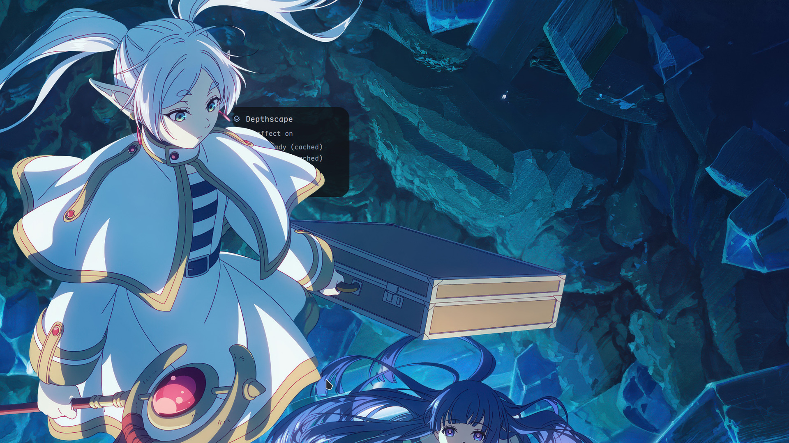

# depthscape

> AI-powered depth-aware wallpapers for DankMaterialShell
> 面向 DankMaterialShell 的景深交互壁纸系统



普通壁纸在 DMS 上只是一张背景图。depthscape 用单目深度估计把它拆成「前景」和「背景」，
再让前景重新绘制在桌面 Widget **之上**——于是人物、头发、近处景物会自然遮住时钟和天气卡片，
效果接近 iOS 的景深锁屏。

上图是真实 niri 会话的截图：芙莉莲的白裙压住了状态卡片的左下半部分，
卡片标题仍然可见。完整设计见 [`docs/depthscape.md`](docs/depthscape.md)，
参考项目分析见 [`docs/reference/noctalia-wallpaper-depth.md`](docs/reference/noctalia-wallpaper-depth.md)。

---

## 架构

```text
QML（DMS Composite Plugin）
  DepthDaemon     监听壁纸变化、串行调度引擎、共享状态
  DepthForeground bottom 层前景 surface（每屏一个，点击穿透）
  DepthStatusWidget / DepthSettings

        │ Process + stdin/stdout，单次调用单行 JSON
        ▼

Rust（depthscape-engine）
  深度推理（ONNX Runtime · Depth Anything V2 Small）
  guided filter 精修 → 阈值 + 羽化 → RGBA 遮罩
  BLAKE3 三级缓存
```

核心原则：**AI 只在壁纸变化时执行一次，桌面运行阶段只做 GPU 合成。**
引擎永不参与逐帧渲染，QML 永不参与 AI 推理。

### 为什么前景层能盖住 Widget

Wayland layer-shell 的层叠顺序是 `background < bottom < top < overlay`，
普通应用窗口由合成器放在 `bottom` 与 `top` 之间。所以前景必须落在 **`bottom` 层**：
放 `background` 会被 Widget 盖住，放 `top` 会盖住窗口。

但 `bottom` 这一层并不独占——DMS 的桌面 Widget 也在 `bottom` 上
（`DesktopPluginWrapper.qml` 的默认分支；官方插件文档说它们在 `background` 层，
**这是错的**）。层间顺序因此不足以定位两者关系，真正起作用的是**同层 map 顺序**：

> **同层内，最后 map 的 surface 在最上层。**

这条规则在 niri/smithay 源码里是显式的（`LayerMap` 是插入序 `IndexSet`，
渲染时按 `.rev()` 从底到顶压入），DMS 自己也依赖它——
`DesktopWidgetLayer.qml` 在 Widget 列表变化时**重建**全部 Widget surface
来重新确立前后关系。depthscape 用同一手段：`DepthDaemon` 监听
`SettingsData.desktopWidgetInstances`，等 DMS 重建完成后再重建自己的前景 surface。

两件事都在真实 niri 会话里量过，而不是推理出来的。判据不是"看起来对不对"，
而是拿真实遮罩做逐像素假设检验（`tools/layer-stacking-test/probe.py`）：

| 状态 | 遮罩不透明区（400×400 面板） | 遮罩透明区（对照组） |
|---|---|---|
| DMS 重建 Widget 之后 | Widget 在上（MAE 0.00，像素级纯色）| 前景在上（MAE 0.63）|
| 触发重建前景之后 | **前景在上**（MAE 1.08）| 前景在上（MAE 0.63）|

也就是：bug 真实存在（晚 map 的同层 surface 会把前景整个压住），
`raiseForeground()` 真实修复它，且对照组两次完全一致，说明测量本身没有漂移。
源码引用、时间预算推导与完整数据见
[`docs/depthscape.md` §14.1](docs/depthscape.md#141-wayland-surface-层级)。

DMS 的插件 API 本身没有提供这一层，它靠插件自行创建 `PanelWindow` 实现
——与 DankIsland 的做法相同。

---

## 环境要求

- DMS ≥ 1.5.0（复合插件支持）
- Rust 1.88+（构建引擎）
- `curl`（仅在下载模型时使用）
- `Qt5Compat.GraphicalEffects` QML 模块（Arch: `qt6-5compat`；
  Debian/Ubuntu: `qml6-module-qt5compat-graphicaleffects`）

不需要 Python，不需要 venv。引擎是单个静态链接的可执行文件。

最后一个依赖值得说明：DMS 本身并不使用它。前景层需要按遮罩的 alpha 合成，
而 DMS 用的 `MultiEffect` 在遮罩源是**不可见 Image** 时不可靠
（实测 63 个采样点中 28 点漏遮），`OpacityMask` 则 63/63 正确。
细节与源码级原因见 [`docs/depthscape.md` §14.2](docs/depthscape.md#142-遮罩合成)。
插件启用前会由 `StartupCheck.qml` 校验该模块是否存在。

---

## 构建

```bash
cd engine
cargo build --release
```

产物：`engine/target/release/depthscape-engine`

## 安装到 DMS

### 从插件商店安装

在 **设置 → 插件 → Browse** 里搜索 *Depthscape* 安装即可
（商店条目见 [`dist/tz-slayer-depthscape.json`](dist/tz-slayer-depthscape.json)）。

⚠️ **引擎需要先编译。** 商店安装只会克隆仓库并加载 QML，不会替你构建 Rust 引擎。
首次启用前需要：

```bash
cd ~/.config/DankMaterialShell/plugins/depthscape/engine
cargo build --release
```

引擎缺失时 `StartupCheck.qml` 会拒绝激活插件，并给出这条命令。

### 从本地目录安装

把仓库链接到插件目录，让 DMS 扫描到：

```bash
ln -s "$(pwd)" ~/.config/DankMaterialShell/plugins/depthscape
```

然后在 **设置 → 插件** 里点击 *Scan for Plugins*，启用 **Depthscape**，
最后重启 shell：

```bash
dms restart
```

引擎二进制按以下顺序查找，无需额外配置：

1. `$DEPTHSCAPE_ENGINE`
2. `<插件目录>/engine/target/release/depthscape-engine`
3. `<插件目录>/engine/target/debug/depthscape-engine`
4. `PATH` 中的 `depthscape-engine`

## 首次使用

1. 打开插件设置，点击 **Install model**（下载 99 MB 模型并校验 SHA-256）
2. 给每个显示器设置一张**图片**壁纸（纯色壁纸会被自动跳过）
3. 遮罩自动生成；效果不满意时调整 **Foreground threshold** 与 **Edge feather**

---

## 引擎 CLI

引擎可以脱离 DMS 单独使用：

```bash
depthscape-engine status                                   # 模型与缓存状态
depthscape-engine setup                                    # 下载并校验模型
depthscape-engine analyze --wallpaper a.png \
    --threshold 0.30 --feather 0.08                        # 输出遮罩
depthscape-engine clear-cache
```

`--data-dir` 默认为 `$XDG_DATA_HOME/depthscape`，也可用 `$DEPTHSCAPE_DATA_DIR` 覆盖。

`analyze` 输出单行 JSON：

```json
{"maskPath":"...png","wallpaperPath":"...","width":2340,"height":1316,
 "depthCacheHit":true,"refinedCacheHit":true,"maskCacheHit":false,"elapsedMs":86}
```

### 参数

| 参数 | 范围 | 含义 |
|---|---|---|
| `--threshold` | 0.0 – 1.0 | 归一化深度阈值。**越低，越多景物挡在 Widget 前面** |
| `--feather` | 0.0 – 0.5 | 阈值附近的对称过渡宽度 |

### 三级缓存

| 层 | 键 | 保留 |
|---|---|---|
| depth | 壁纸内容 + 模型指纹 + 推理分辨率 | 8 |
| refined | depth 键 + 精修版本 | 4 |
| mask | refined 键 + threshold + feather | 32 |

深度与精修都与 threshold/feather 无关，所以**拖动滑块不会重跑模型，也不会重跑 guided filter**。

实测（5120×2880 壁纸，2560×1440 输出）：

| 场景 | 耗时 |
|---|---|
| 冷启动（推理 + 精修 + 编码） | 1050 ms |
| 全缓存命中 | 109 ms |
| 仅改 threshold / feather（depth + refined 命中） | 251 ms |

滑块场景的 251 ms 主要花在按原分辨率重新编码 PNG；精修与推理都被跳过了。

---

## 预览工具

不必重启 shell 就能检查效果——把同样的分层逻辑在浏览器里复现：

```bash
tools/make-preview.py --wallpaper ~/Pictures/Wallpapers/some.png
```

生成一个自包含的 `preview.html`，可以分别开关前景层和 Widget 层，
用来确认遮罩范围是否符合预期。

## 层级回归测试

改动 `qml/DepthForeground.qml` 或 `DepthDaemon.qml` 里任何与层级、
遮罩合成、前景重建相关的代码之后，跑一遍真实会话夹具：

```bash
tools/layer-stacking-test/setup.sh
export DEPTHSCAPE_ENGINE=$PWD/engine/target/release/depthscape-engine
qs -p tools/layer-stacking-test
```

它会用**真实的** `DepthDaemon` / `DepthForeground` 搭出「早 map 的同层 Widget +
晚 map 的同层 Widget」场景，`probe.py` 读截图后给出前景与 Widget 谁在上的判决
（退出码 0 通过 / 1 失败）。步骤、读数含义与实测数据见
[`tools/layer-stacking-test/README.md`](tools/layer-stacking-test/README.md)。

---

## 当前状态

已完成（V0.1 骨架）：

- [x] Rust 引擎：深度推理、guided filter 精修、遮罩生成
- [x] 三级 BLAKE3 缓存 + 原子写入 + LRU 裁剪
- [x] 模型下载与 SHA-256 校验
- [x] 单任务队列 + 陈旧结果丢弃
- [x] DMS 复合插件：daemon / desktop / settings
- [x] `bottom` 层前景 surface，点击穿透
- [x] 层级与点击穿透在真实 niri 会话中实测确认（见 `docs/depthscape.md` §14.1）
- [x] 前景遮挡同层、先于它 map 的 surface：真实组件 + 真实遮罩逐像素验证通过
- [x] Widget 列表变化后自动重建前景 surface：bug 已复现、修复已验证
      （`tools/layer-stacking-test/`）
- [x] 引擎在真实动漫壁纸上端到端跑通（5120×2880，模型 SHA-256 校验通过）
- [x] 预览工具
- [x] 装进真实 DMS 会话跑通：前景确实盖住启用中的桌面 Widget
      （`tools/layer-stacking-test/` 的夹具测不出的两个集成 bug 已在此暴露并修掉，
      见 `docs/depthscape.md` §14.1 与 §14.5）

待验证 / 待做：

- [ ] **引擎在插件内一键构建**——目前要求用户手动 `cargo build --release`，
      是商店安装最大的摩擦点（设置页已有 install / regenerate / clearCache
      三个动作，加一个 build 是同一条通路）
- [ ] Hyprland 实测（`compositors` 目前只声明 `niri`；插件本身不调用任何
      niri 专用接口，同层 map 顺序在 wlroots 上的行为未验证）
- [ ] 多显示器实测（遮挡只在 DP-1 上逐像素验证过）
- [ ] 设置页的动作按钮（安装/重新生成/清缓存）联调
- [ ] 插件 i18n（`translations/` 需要由工具生成，目前回退到英文字面量）
- [ ] 鼠标视差（V0.3，届时通信升级为 Unix Domain Socket）
- [ ] 深度 Shader（V0.4，WGSL + wgpu）

## 发布

已提交插件商店所需的 `plugin.json` 与 registry 条目：

- `plugin.json` 通过 DMS 官方 schema（`PLUGINS/plugin-schema.json`）校验
- registry 条目：[`dist/tz-slayer-depthscape.json`](dist/tz-slayer-depthscape.json)
  —— 内容需与 `plugin.json` 的 `id` / `name` 完全一致，仓库地址与截图 URL 必须可达
- 商店预览卡：`https://api.danklinux.com/previews/depthscape`

## 许可

MIT。Depth Anything V2 Small 由 Hugging Face 在 Apache-2.0 下提供，首次使用时本地下载。
所有推理、深度图与遮罩都留在本地，只有模型下载会联网。
