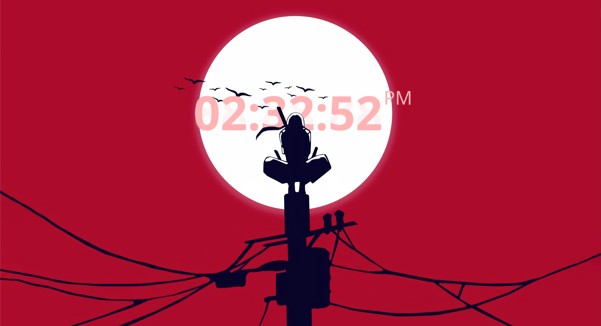

# Depthscape

Depth-aware wallpapers for DankMaterialShell. A local depth model splits your
wallpaper into near and far, and the near part is redrawn above the desktop
widgets — so characters and scenery occlude your clock and cards, the way an
iOS depth-effect lock screen does.



The model runs once per wallpaper change. The desktop side is pure GPU
compositing, so nothing is inferred while you work.

## Features

- Local depth estimation with Depth Anything V2 Small — no network access after
  the one-time model download
- Three-tier cache: dragging the sliders never re-runs the model
- One mask per monitor
- Click-through foreground layer, so the widgets underneath stay usable
- Navigation parallax: the scene shifts as you change workspace or column, with
  the foreground moving further than the background
- Desktop status tile and a settings page

## Requirements

- DankMaterialShell 1.5.0 or newer
- Rust 1.88+ (to build the engine)
- `curl` (model download only)
- `Qt5Compat.GraphicalEffects` — `qt6-5compat` on Arch,
  `qml6-module-qt5compat-graphicaleffects` on Debian/Ubuntu

## Build the engine

The plugin store installs the QML, not the engine. Build it once:

```bash
cd engine
cargo build --release
```

The binary is looked up in `$DEPTHSCAPE_ENGINE`, then
`<plugin dir>/engine/target/release`, then `debug`, then `PATH`. If none of them
exist, the startup check refuses to activate the plugin and prints this command.

## Install

From the plugin store, search for *Depthscape* under **Settings → Plugins →
Browse**.

From a local checkout:

```bash
ln -s "$(pwd)" ~/.config/DankMaterialShell/plugins/depthscape
dms restart
```

Then enable **Depthscape** under **Settings → Plugins**.

## First run

1. Open the plugin settings and press **Install model**. This downloads 99 MB
   from Hugging Face and verifies a pinned SHA-256.
2. Set an **image** wallpaper on each monitor. Solid colours are skipped.
3. Masks are generated automatically. If the result is too aggressive or too
   subtle, adjust **Foreground threshold** and **Edge feather**.

## Engine CLI

The engine also works standalone:

```bash
depthscape-engine status
depthscape-engine setup
depthscape-engine analyze --wallpaper a.png --threshold 0.30 --feather 0.08
depthscape-engine clear-cache
```

`analyze` prints a single line of JSON with the mask path and the cache status.
`--threshold` (0.0–1.0) is the depth cutoff — lower values bring more of the
scene in front — and `--feather` (0.0–0.5) is the transition width around it.

## Status

Working on niri. Hyprland is expected to work but is untested, which is why
`compositors` lists only niri. Occlusion has been verified pixel-by-pixel on a
single output so far. Planned: mouse parallax, a depth shader, and building the
engine from inside the plugin.

## License

MIT. Depth Anything V2 Small is distributed by Hugging Face under Apache-2.0 and
downloaded on first use. All inference, depth maps and masks stay on your
machine; only the model download touches the network.
