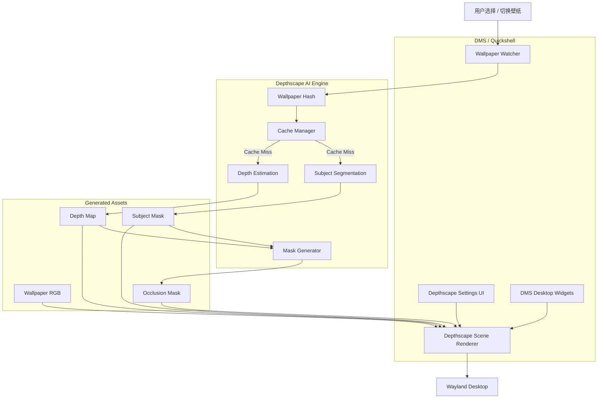

# depthscape

> **AI-powered depth-aware and interactive wallpapers for DankMaterialShell**  
> 面向 DankMaterialShell 的 AI 景深交互壁纸系统。

---

## 1. 项目简介

**depthscape** 是一个面向 DankMaterialShell（DMS）的景深壁纸与交互壁纸扩展项目。

项目目标不是简单地“播放动态壁纸”，而是将普通 2D 壁纸解析为具有前景、背景和深度信息的桌面场景，并利用 DMS / Quickshell / QtQuick 的桌面渲染能力实现：

- 前景人物遮挡桌面组件；
- 类 iOS 锁屏的景深效果；
- AI 自动深度估计；
- AI 主体分割；
- 鼠标驱动的 2.5D 视差；
- 基于深度图的 Shader 效果；
- 可选的粒子、音频响应和场景交互；
- 多显示器独立壁纸与独立缓存。

项目遵循一个核心原则：

> **AI 只在壁纸变化时执行一次，桌面运行阶段只进行轻量级 GPU 合成与动画。**

这使得depthscape 能在保留视觉效果的同时，避免持续进行 AI 推理带来的 CPU/GPU 占用和功耗问题。

---

## 2. 项目定位

DMS Depthscape 不只是一个壁纸选择器，也不只是 `mpvpaper` 的前端。

它更接近一个运行在 DMS 上的：

```text
AI Wallpaper Scene Engine
```

整体能力规划如下：

```text
DMS Depthscape
│
├── Wallpaper Source
│   ├── Local
│   ├── Pixiv
│   ├── Wallhaven
│   └── Other Providers
│
├── AI Analysis
│   ├── Subject Segmentation
│   ├── Depth Estimation
│   └── Scene Analysis
│
├── Depth Effects
│   ├── Widget Occlusion
│   ├── Foreground Mask
│   ├── Multi-layer Composition
│   └── Depth-aware Blur
│
├── Interactive Effects
│   ├── Mouse Parallax
│   ├── Click Ripple
│   ├── Particle Effects
│   └── Character Interaction
│
├── Reactive Effects
│   ├── Audio Reactive
│   ├── Time Reactive
│   ├── Weather Reactive
│   └── Workspace Reactive
│
└── DMS Integration
    ├── Desktop Widgets
    ├── Theme
    ├── Settings
    ├── Multi-monitor
    └── Wallpaper Lifecycle
```

---

## 3. 核心使用场景

### 3.1 iOS 风格主体遮挡

用户选择一张人物壁纸后，系统自动识别前景人物：

```text
Original Wallpaper
        │
        ▼
Subject Segmentation
        │
        ▼
Foreground Mask
```

桌面最终采用如下分层：

```text
Foreground Character
        ↑
Clock / Weather / Media Widget
        ↑
Background Wallpaper
```

从而形成：

```text
              14:32
           ┌─────────┐
           │ Weather │
           └─────────┘
               ███
            █████████
           █  Character █
            █████████
```

人物头部、头发或身体可以自然遮挡部分时间和 Widget，形成类似 iOS 景深锁屏的视觉效果。

---

### 3.2 AI 自动景深

对于没有人工分层的普通图片，Depthscape 使用单目深度估计模型生成 Depth Map：

```text
Wallpaper
    │
    ▼
Depth Model
    │
    ▼
Depth Map
    │
    ├── Near
    ├── Mid
    └── Far
```

深度图可用于：

- 自动生成前景 Mask；
- 控制 Widget 遮挡；
- 鼠标视差；
- 景深模糊；
- 多层位移；
- Shader 效果。

---

### 3.3 2.5D 鼠标视差

当用户移动鼠标时，根据 Depth Map 对不同深度区域施加不同位移：

```text
Mouse Move
    │
    ▼
Normalized Cursor Position
    │
    ▼
Depth-aware Offset
    │
    ├── Foreground: large offset
    ├── Midground: medium offset
    └── Background: small offset
```

最终形成近景移动快、远景移动慢的空间感。

---

## 4. 总体架构



---

## 5. 运行流程

### 5.1 壁纸发生变化

```text
DMS Wallpaper Changed
        │
        ▼
DepthDaemon / WallpaperWatcher
        │
        ▼
计算壁纸 Hash
        │
        ▼
检查缓存
        │
   ┌────┴────┐
   │         │
命中缓存    未命中
   │         │
   │         ▼
   │      AI 推理
   │         │
   │         ▼
   │    生成 Depth / Mask
   │         │
   └────┬────┘
        ▼
加载场景资源
        │
        ▼
DMS Desktop Rendering
```

### 5.2 正常桌面运行

正常桌面状态下不再调用 AI 模型：

```text
Cached RGB / Depth / Mask
            │
            ▼
       QtQuick / GPU
            │
            ├── Widget Occlusion
            ├── Parallax
            ├── Shader
            └── Animation
            │
            ▼
         Display
```

---

## 6. 技术栈

### 6.1 技术栈总览

| 层          | 技术                          | 用途                             |
| ---------- | --------------------------- | ------------------------------ |
| Shell 宿主   | **DMS**                     | 插件生命周期、主题、配置                   |
| UI         | **QML / QtQuick**           | 设置页、预览、前景渲染                    |
| Shell API  | **Quickshell**              | Process、Wayland surface、DMS 集成 |
| 插件形式       | **DMS Composite Plugin**    | Daemon + Desktop + Settings    |
| 核心后端       | **Rust**                    | 模型调用、深度图、Mask、缓存               |
| AI Runtime | **ONNX Runtime**            | 本地推理                           |
| V1 模型      | **Depth Anything V2 Small** | 单目深度估计                         |
| 图像处理       | Rust `image` 等 crate        | resize、mask、blur、RGBA          |
| 缓存 Hash    | **BLAKE3**                  | 壁纸/model/参数缓存键                 |
| 配置交换       | **JSON**                    | QML ↔ Rust                     |
| V1 通信      | Process + stdin/stdout      | 简单稳定                           |
| V2/V3 通信   | Unix Domain Socket          | 实时视差/长期 daemon                 |
| V3 GPU     | **WGSL + wgpu**             | 2.5D / Parallax / Shader       |

V1 额外引入一个 QML 模块：**`Qt5Compat.GraphicalEffects`**（`OpacityMask`），
用于把遮罩合成到前景层。这不是随意选择——`MultiEffect` 在本环境下做遮罩不可靠，
实测与原因见 §14.2。该模块在 `plugin.json` 的 `dependencies` 中声明，
并由 `StartupCheck.qml` 在启用插件前校验。

### 6.2 核心后端选定 Rust

AI 处理链路（模型调用、深度图、Mask 生成、缓存）全部放在独立的 Rust 可执行文件
`depthscape-engine` 中，而不是 Python 脚本。

理由：

- **无解释器依赖**：用户机器不需要装 Python，也不需要引导 venv、下载 wheel；
  安装即一个静态链接的二进制；
- **启动成本低**：每次换壁纸都要拉起一次进程，Python 解释器 + numpy + onnxruntime
  的导入开销在秒级，Rust 可以压到毫秒级；
- **内存可控**：99 MB 模型 + 中间张量的驻留内存可预测，不会因为 GC 抖动影响 shell；
- **崩溃隔离**：引擎进程崩溃不会带走 DMS 会话。

代价是编译期依赖变重（ONNX Runtime 绑定 + 图像库），但复杂度被留在构建阶段，
而不是留在用户机器上。

### 6.3 进程边界与通信演进

```text
V1   Process + stdin/stdout      一次调用一次进程，无状态
V2   Unix Domain Socket          常驻 daemon，双向请求/响应
V3   Unix Domain Socket + 共享内存  视差等高频交互
```

V1 刻意选择「短进程 + 标准流」：

- 无状态，每次调用自带全部参数，调试时可直接在终端手敲；
- 输出单行 JSON，QML 侧解析即可，无需处理粘包与缓冲；
- 引擎异常退出时 shell 只需丢弃本次结果，不存在连接状态残留。

当 V3 引入鼠标视差后，交互频率会从「换壁纸时一次」变成「鼠标移动时每帧」，
进程模型不再合适，此时升级为 UDS 常驻 daemon；若届时仍受 IPC 开销限制，
再考虑共享内存传递深度纹理。

### 6.4 缓存 Hash 使用 BLAKE3

缓存键（壁纸内容 / 模型指纹 / 参数组合）统一使用 BLAKE3：

- 壁纸文件动辄数 MB 到数十 MB，且**每次切换壁纸都要计算一次哈希**；
- BLAKE3 具备 SIMD 并行与多线程能力，吞吐显著高于 SHA-256；
- 输出 256 位，作为缓存键足够。

例外：**模型文件的完整性校验仍使用上游发布的 SHA-256**。
Depth Anything V2 Small 的官方发布值可以直接人工核对，且与 Hugging Face
页面上的信息对齐；用 BLAKE3 会让这个校验值失去外部可验证性。

### 6.5 AI 阶段与渲染阶段的边界

技术栈严格对应两个互不重叠的阶段：

```text
AI 阶段（Rust + ONNX Runtime）
    壁纸变化 → 推理 → 深度图 → Mask → 落盘缓存
    低频、可阻塞、允许秒级耗时

渲染阶段（QML / QtQuick，V3 起为 WGSL + wgpu）
    缓存资源 → GPU 合成 → 遮挡 / 视差 / Shader
    高频、不可阻塞、目标 60fps
```

Rust 侧永远不参与逐帧渲染，QML 侧永远不参与 AI 推理。
V1/V2 的实时效果走 QtQuick Scene Graph 与 ShaderEffect；
只有在 V3 需要深度驱动的自定义着色器管线时，才引入 WGSL + wgpu。

---

## 7. 模块设计

### 7.1 WallpaperWatcher

负责监听 DMS 当前壁纸变化。

职责：

```text
Wallpaper Changed
      ↓
resolve path
      ↓
calculate hash
      ↓
request analysis
```

不负责 AI 推理。

---

### 7.2 DepthEngine

独立的 Rust 模块，编译为单个可执行文件 `depthscape-engine`。
它只负责把壁纸变成遮罩，不参与渲染，也不与合成器通信。

输入：

```text
wallpaper.png / jpg / webp
```

输出（全部落在插件数据目录，由引擎自行管理）：

```text
cache/depth/<key>.dsc     模型原始输出，f32，推理分辨率
cache/refined/<key>.dsr   精修后的深度，u16，精修分辨率
cache/masks/<key>.png     遮罩，RGBA（alpha 即覆盖度），原分辨率
```

接口：

```bash
depthscape-engine analyze --wallpaper <path> --threshold 0.30 --feather 0.08
```

返回单行 JSON：

```json
{
  "maskPath": "...",
  "wallpaperPath": "...",
  "width": 2340,
  "height": 1316,
  "depthCacheHit": true,
  "refinedCacheHit": true,
  "maskCacheHit": false,
  "elapsedMs": 86
}
```

> 遮罩使用 **RGBA 而非灰度**：QML 侧用 `OpacityMask` 按 alpha 通道遮罩，
> 灰度 PNG 会以 `alpha = 1` 载入，导致整个屏幕被前景覆盖。
> （为什么不是 `MultiEffect`：见 §14.2。）

V1 采用「一次调用一次进程」：无状态、可直接在终端手敲调试、
引擎崩溃不影响 shell 会话；输出单行 JSON，QML 侧无需处理粘包。

---

### 7.3 CacheManager

缓存分三级，因为三种产物被重新计算的频率差了两个数量级：
换壁纸要重算全部，改参数只该重算最后一层。

```text
$XDG_DATA_HOME/depthscape/cache/
├── depth/<key>.dsc      模型输出（f32）        保留 8
├── refined/<key>.dsr    精修深度（u16）        保留 4
└── masks/<key>.png      遮罩（RGBA）          保留 32
```

键的构造（哈希算法为 BLAKE3）：

```text
depth   = BLAKE3(壁纸内容) - 模型指纹 - d<depth pipeline 版本> - i<推理尺寸>
refined = depth - r<refine 版本>
mask    = refined - v<mask pipeline 版本> - t<threshold> - f<feather>
```

两个关键点：

1. **模型指纹取模型文件自身的哈希前缀**，而不是仓库 revision 字符串。
   前者能捕获任何导致权重变化的替换，后者不能。
2. **`refined` 层与 threshold / feather 无关**，因此拖动滑块既不会重跑模型，
   也不会重跑 guided filter——这是三级拆分存在的全部理由。
   参考项目只拆了两级，滑块每动一次仍要付一次完整精修。

清理按 `mtime` 倒序做 LRU；写入一律先落临时文件再 `rename`，
保证读到的要么是完整的旧版本，要么是完整的新版本。

> 缓存放 `$XDG_DATA_HOME` 而不是 `~/.cache`：遮罩是用户显式要求生成、
> 且重新生成代价较高的产物，不该被系统清理工具当成可随意丢弃的临时文件。

---

### 7.4 MaskGenerator

根据 Depth Map / Subject Mask 生成最终遮挡 Mask。

主要参数：

```text
Depth Threshold
Feather
Blur Radius
Subject Priority
Mask Expansion
Mask Erosion
```

例如：

```text
Depth < threshold
      ↓
Foreground
      ↓
Feather edge
      ↓
Occlusion Mask
```

---

### 7.5 SceneRenderer

负责实时桌面效果。

V1：

```text
Wallpaper
   ↓
Widgets
   ↓
Foreground Mask Layer
```

V2：

```text
Wallpaper + Depth
      ↓
Depth-aware Parallax
      ↓
Widgets
      ↓
Foreground
```

V3：

```text
Depth Texture
+ RGB Texture
+ Cursor
+ Audio
      ↓
ShaderEffect
      ↓
Interactive Scene
```

---

## 8. DMS 集成设计

推荐将项目设计为 Composite Plugin：

```text
Depthscape Plugin
│
├── Daemon
│   └── 监听壁纸变化与后台分析
│
├── Desktop
│   └── 景深 / 前景渲染
│
├── Settings
│   └── 参数配置
│
└── Optional Widget
    └── 快捷启停 / 当前状态
```

### 设置页面建议

```text
Depthscape
│
├── General
│   ├── Enable Depth Effect
│   ├── Auto Analyze Wallpaper
│   └── Cache Size
│
├── AI
│   ├── Mode
│   │   ├── Subject
│   │   ├── Depth
│   │   └── Hybrid
│   ├── Backend
│   └── Model
│
├── Occlusion
│   ├── Threshold
│   ├── Feather
│   ├── Mask Expansion
│   └── Preview Mask
│
├── Parallax
│   ├── Enable
│   ├── Strength
│   ├── Smoothing
│   └── Max Offset
│
├── Effects
│   ├── Depth Blur
│   ├── Particle
│   └── Audio Reactive
│
└── Displays
    ├── HDMI-A-1
    └── DP-1
```

---

## 9. 项目结构

以下是 V0.1 已落地的实际结构：

```text
depthscape/
├── README.md
├── plugin.json                 DMS Composite Plugin 清单
│
├── qml/                        Shell 侧（QML / QtQuick）
│   ├── DepthDaemon.qml         daemon：壁纸监听、任务队列、状态共享、前景 surface 重建
│   ├── DepthForeground.qml     bottom 层前景 surface（每屏一个，点击穿透）
│   ├── DepthStatusWidget.qml   desktop：状态卡片（兼作效果演示）
│   ├── DepthSettings.qml       settings：阈值、羽化、动作按钮
│   └── StartupCheck.qml        校验引擎二进制是否存在
│
├── engine/                     Rust 侧
│   ├── Cargo.toml
│   └── src/
│       ├── main.rs             CLI 分发（status / setup / analyze / clear-cache）
│       ├── config.rs           路径、模型指纹、pipeline 版本与常量
│       ├── protocol.rs         与 QML 交换的 JSON 结构
│       ├── cache.rs            BLAKE3 三级缓存、原子写入、LRU 裁剪
│       ├── imageops.rs         积分图 box_mean、guided filter、smoothstep
│       ├── depth.rs            ONNX Runtime 推理与归一化
│       ├── model.rs            模型下载与 SHA-256 校验
│       └── pipeline.rs         端到端编排：深度 → 精修 → 遮罩
│
├── tools/
│   ├── make-preview.py         浏览器内的分层预览，免重启 shell 检查效果
│   └── layer-stacking-test/    同层遮挡与 raise 的集成夹具（见 §14.1）
│       ├── setup.sh            搭 DMS import 根的符号链接
│       ├── shell.qml           被测场景：真实前景层 + 早/晚 map 的同层 Widget
│       ├── probe.py            用遮罩做逐像素假设检验，输出前景/Widget 谁在上
│       └── README.md           运行步骤与实测数据
│
└── docs/
    ├── depthscape.md           本文件
    └── reference/
        └── noctalia-wallpaper-depth.md   参考项目对照分析
```

运行期产物（不在仓库内）：

```text
$XDG_DATA_HOME/depthscape/
├── models/depth-anything-v2-small/model.onnx
├── cache/depth/       *.dsc   模型输出，f32，推理分辨率
├── cache/refined/     *.dsr   精修深度，u16，精修分辨率
├── cache/masks/       *.png   遮罩，RGBA，原分辨率
└── runtime/generate.lock
```

> 后续版本新增的能力（视差、Shader）应扩展 `qml/DepthForeground.qml` 与 `imageops.rs`，
> 而不是引入新的顶层目录。

---

## 10. 版本路线

### V0.1 — Depth Effect MVP

目标：实现最小可用的 iOS 风格景深效果。

功能：

- [ ] 监听 DMS 壁纸变化
- [ ] AI 主体分割
- [ ] 生成 foreground mask
- [ ] 缓存 mask
- [ ] 前景人物遮挡指定桌面 Widget
- [ ] 基础设置页面
- [ ] 手动重新分析
- [ ] 清除缓存

核心效果：

```text
Wallpaper
   ↓
Clock
   ↓
Character
```

---

### V0.2 — AI Depth

- [ ] Depth Anything 模型
- [ ] Depth Map Preview
- [ ] Threshold 调整
- [ ] Feather 调整
- [ ] Subject + Depth Hybrid Mode
- [ ] 多显示器独立处理

---

### V0.3 — Parallax

- [ ] 鼠标视差
- [ ] 深度相关位移
- [ ] 平滑滤波
- [ ] 最大位移限制
- [ ] Lazy animation
- [ ] Idle 时停止刷新

---

### V0.4 — Depth Shader

- [ ] Depth-aware blur
- [ ] Ripple
- [ ] Lighting
- [ ] Foreground glow
- [ ] GPU shader pipeline

---

### V0.5 — Interactive Wallpaper

- [ ] 点击响应
- [ ] Particle Engine
- [ ] Character interaction
- [ ] Audio reactive effect
- [ ] Workspace reactive effect

---

### V1.0 — DMS Wallpaper Scene Engine

目标：形成完整稳定版本。

```text
Static Wallpaper
+ AI Depth
+ Subject Segmentation
+ Widget Occlusion
+ Parallax
+ Shader
+ Interactive Effects
```

---

## 11. 性能目标

Depthscape 应严格区分 AI 阶段与运行阶段。

### AI 分析阶段

允许短时间占用较高资源：

```text
Wallpaper Changed
      ↓
1 × AI Inference
      ↓
Cache
```

建议目标：

- 1080p / 1440p 壁纸在数秒内完成分析；
- 不阻塞 DMS 主 UI；
- 分析过程异步执行；
- 支持取消旧任务，防止连续换壁纸造成任务堆积。

### 正常运行阶段

目标：

```text
AI inference = 0
```

运行时仅保留：

- GPU texture；
- mask；
- Shader；
- 动画；
- 少量状态更新。

对于 Parallax：

```text
Mouse moving
→ refresh

Mouse idle
→ stop / reduce refresh
```

避免无意义的持续高刷新。

---

## 12. 多显示器设计

每块屏幕独立维护：

```text
DisplayState
├── wallpaper
├── depthMap
├── subjectMask
├── occlusionMask
├── parallaxState
└── settings
```

示例：

```text
DP-1
└── anime-a.jpg

HDMI-A-1
└── anime-b.jpg
```

Depthscape 不应假设所有显示器使用同一壁纸。

---

## 13. 隐私与安全

AI 分析默认应完全在本地运行：

```text
Wallpaper
   ↓
Local Model
   ↓
Local Cache
```

默认不上传：

- 壁纸原图；
- 深度图；
- 人物 Mask；
- 用户桌面截图。

如果未来增加在线模型，应明确作为可选功能，并在 UI 中清楚提示数据流向。

---

## 14. 已知技术难点

### 14.1 Wayland Surface 层级

最核心的问题不是 AI，而是如何稳定实现：

```text
Wallpaper
   ↓
Desktop Widgets
   ↓
Foreground Subject
   ↓
Normal Application Windows
```

QML 中的 `z: 999` 只对同一个 QtQuick scene / surface 内部有效，
不能保证跨 Wayland surface 的 stacking 顺序。这个判断是对的，
但它并不像原先设想的那样需要改动 DMS 核心。

**结论：不需要 patch DMS，靠 layer-shell 的层级 + 同层 map 顺序即可实现。**

#### 层间顺序

`wlr-layer-shell` 定义的顺序是：

```text
background  <  bottom  <  top  <  overlay
                    ↑
        普通应用窗口由合成器放在 bottom 与 top 之间
```

#### 同层顺序：map 顺序

DMS 的桌面 Widget 落在 **`bottom`** 层，与 depthscape 的前景**同层**，
因此层间顺序不足以定位两者关系，必须依赖同层排序规则。

**实测结论（niri 26.04 + smithay）：同层内按 map 顺序堆叠，最后 map 的 surface 在最上层。**

机制在 niri 源码里是显式的 —— `src/niri.rs`：

```rust
fn layers_in_render_order(...) {
    // LayerMap returns layers in reverse stacking order.
    layer_map.layers_on(layer).rev().filter_map(...)
}
```

`layers_on()` 来自 smithay 的 `LayerMap`，其 `layers` 字段是
`IndexSet<LayerSurface>`，`map_layer()` 以 `insert` 追加。
`.rev()` 之后按「底 → 顶」的顺序压入渲染列表，于是**后 map 者后画、因而在最上**。

DMS 自己就依赖这条规则，并在源码里写明了 —— `Modules/DesktopWidgetLayer.qml`：

```qml
// Layer surfaces stack by map order, so recreate them in list order on
// reorder/enable/display-pref changes or once a plugin component loads (#2715).
...
// Reversed so the top of the list maps last and renders in front.
values: [...(SettingsData.desktopWidgetInstances || [])].reverse()
```

#### 由此确定的两条设计约束

**1. 前景必须放在 `bottom` 层。**

- `background`：会被桌面 Widget 盖住，前景永远不可见；
- `top` / `overlay`：会盖住普通应用窗口，不可接受；
- `bottom`：正好落在「壁纸与 Widget 之上、应用窗口之下」。

**2. 前景必须在桌面 Widget 之后 map。**

`wlr-layer-shell` 没有「raise」请求，唯一手段是销毁并重建 surface
（`unmap` 会把 surface 从 `LayerMap` 中移除，重新 `map` 即追加到末尾）。
DMS 在 Widget 列表变化时会重建它自己的全部 Widget surface，
届时 depthscape 的前景会被压在后面，因此 `DepthDaemon` 监听
`SettingsData.desktopWidgetInstances`，等 DMS 自己的去抖（150ms + 32ms）结束后
再重建前景 surface。

**但 `desktopWidgetInstances` 不是唯一的触发条件。** 读
`DesktopWidgetLayer.qml` 可以看到它有两个去抖入口：

```qml
onOrderSignatureChanged: rebuildDebounce.restart()   // 列表/启用/显示偏好变化
onPluginReadyKeyChanged: rebuildDebounce.restart()   // 插件的桌面组件加载完成
```

`pluginReadyKey` 派生自 `PluginService.pluginDesktopComponents`。
**这条在 shell 每次启动时都必然发生，而且发生在本插件 daemon 映射前景之后**
——于是 Widget 会压在前景上，用户看到的效果就是「没生效」。
这个 bug 只有在真实会话里装上插件才会暴露，夹具（三个 surface 同一时刻创建）
测不出来。

修法是监听 DMS 用的同一个属性，再加一个启动兜底：

```qml
Connections {
    target: PluginService
    function onPluginDesktopComponentsChanged() { widgetRebuildTimer.restart(); }
}

// 兜底：上面那条信号可能在本 daemon 构造之前就发过了，
// 冷启动时首个遮罩也可能晚于它。延迟再顶一次，两种情况都覆盖。
Timer { interval: 3000; running: true; repeat: false
        onTriggered: root.raiseForeground() }
```

兜底是无害的：如果前景尚未 map，`raiseForeground()` 是空操作；
而遮罩就绪时 surface 自然会最后 map、因而在最上。

日常主路径不需要额外处理：换壁纸时 `maskPath` 先被清空、前景 surface 被
unmap，新遮罩就绪后重新 map，自然处于最上层。

时间预算：DMS 在 `orderSignature` 变化后先等 `rebuildDebounce` 150ms、
再等 `rebuildApply` 32ms 才把 `rebuilding` 置回 `false`，其新 surface
大约在 182ms 时 map；depthscape 等到 400ms 再动，加自身 32ms 去抖，
约 432ms 时 map。两者都由同一个属性变更信号触发，因此**顺序是常量保证的**，
不依赖调度时序。取 400ms 而非贴着实测值，是为了给 Qt 创建 surface
留出余量。

#### 点击穿透

前景 surface 必须完全不接收输入，否则会挡住桌面 Widget 的点击：

```qml
mask: Region {}          // 空输入区域 = 完全点击穿透
```

`Region {}`（不含 `item`）即空输入区域。这与 DMS 自身用法一致
（`DesktopPluginWrapper.qml` 的 `emptyMask` 与桌面 Widget 网格覆盖层）。

#### 实测记录一：纯色探针

在真实 niri 会话中，用一个独立的 Quickshell 实例（`qs -p`，不影响运行中的 DMS）
放两个**同层重叠**的纯色 surface，再用 `niri msg action screenshot-screen --path`
截图取重叠区像素：

| 实验  | map 顺序                   | 重叠区颜色   | 结论                  |
| --- | ------------------------ | ------- | ------------------- |
| 1   | A(红) → B(蓝)              | 蓝       | 后 map 者在上           |
| 2   | A(红) → B(蓝) → A 重 map    | 红       | 重建 surface 可把前景顶到最上 |
| 3   | A、B 均用 `mask: Region {}` | 两者均正常渲染 | 空掩码不影响渲染，仅清空输入区域    |

实验 1 的对照点：A 独占区（1000,600）为红、B 独占区（1400,1000）为蓝，
确认几何无误后重叠区（1200,800）取到蓝色。

实验用 surface 放在 `top` 层而非 `bottom`：同层排序规则来自同一个
`LayerMap` 插入序集合、与具体层无关，而 `top` 层不会被应用窗口遮挡，
因此结论可直接套用到 `bottom`。

> `niri msg layers` 的输出顺序**不能**用来判断 z 序。它是 `LayerMap` 的
> 原始迭代顺序，实验 1 与实验 2 中该顺序相同，但实际最上层相反。

#### 实测记录二：真实前景层 + 同层 Widget 端到端

纯色探针只验证了机制本身。真正的判据是：**加载真实的
`DepthDaemon.qml` / `DepthForeground.qml`，让它们在真实遮罩下与同层
Widget 相遇**，再用遮罩做逐像素假设检验。

夹具见 `tools/layer-stacking-test/`（`setup.sh` 搭符号链接、`shell.qml`
是被测场景、`probe.py` 出结论）。场景：`W1` 洋红 400×400 先 map；
真实 `DepthDaemon` 随后 map 全屏前景；`W2` 青色 400×400 在 t=14s 才 map，
用来模拟 DMS 重建 Widget。

判据不看单点，而是在整块 400×400 上比较两个竞争假设：

```text
H_fg      alpha * wallpaper + (1 - alpha) * widget_color
H_widget  widget_color
```

平均绝对误差（0..255）低者胜。正确合成时胜者约 1、败者约 100。

| 状态            | W2（遮罩不透明区）                                             | W1（遮罩透明区，对照组）             |
| ------------- | ------------------------------------------------------ | ------------------------- |
| 重建后（bug）      | MAE[前景在上] 104.32 / MAE[Widget 在上] **0.00** → Widget 在上 | MAE[前景在上] **0.63** → 前景在上 |
| `raise` 后（修复） | MAE[前景在上] **1.08** / MAE[Widget 在上] 104.35 → 前景在上      | MAE[前景在上] **0.63** → 前景在上 |

`W2` 的 0.00 表示整块面板像素级纯青——晚 map 的 Widget 完全压在前景之上，
bug 真实存在。`raise` 之后同一块面板与遮罩模型吻合到 1.08/255；
面板左下角残留的青色楔形正是遮罩在那里确实透明，不是失败：
该矩形内 alpha < 0.05 的像素占 **21.76%**、alpha < 0.5 的占 26.21%，
而观测到的纯青像素占 23.74%——落在两者之间，差值正是半透明的过渡带。
`W1` 两次数值完全相同，说明对照组不受影响，也说明测量本身没有漂移。

其它同步验证：

- 连续两次 `raise` 后 `niri msg layers` 每个输出仍**恰好一个**
  `dms:plugins:depthscape-foreground`，`Loader` 的销毁重建不泄漏 surface；
- 整个 raise 周期日志无 QML 报错、无绑定循环告警；
- `raise` 调用到新 surface 落地的延迟落在 114–153ms 之间：114ms 时采到的仍是
  旧状态、153ms 时已是新状态。这个数字与 DMS 自身的 150ms 去抖同量级，
  但**不影响正确性**——顺序由前面那组常量保证，不由绝对延迟保证。

#### 仍需确认

- Hyprland / Sway 是否同样按 map 顺序堆叠（两者都基于 smithay，
  预期一致，但未实测）；
- 若某个合成器不把普通窗口放在 `bottom` 与 `top` 之间，
  退化方案是向 DMS 上游提案一个 `setWallpaperMask` 风格的 API，
  而不是改用 `top` 层——那会盖住窗口，属于不可接受的降级；
- `SettingsData.desktopWidgetInstancesChanged` → 400ms 定时器 → 重建前景
  这条**触发链路**尚未在真实 DMS 会话中跑到：用户当前的
  `desktopWidgetInstances` 全部 `enabled: false`，要触发就得改动其配置。
  已单独验证的两端是「信号本身存在且带变更通知」（`SettingsData.qml`
  `property var desktopWidgetInstances: []`）与「`raiseForeground()` 确实
  能把前景顶到最上」（上表）。

---

### 14.2 遮罩合成

前景层的渲染只有一步：把壁纸按遮罩的 alpha 合成出来。这一步在 Qt6 里
有两种写法，而**只有一种能用**。

`MultiEffect` 是 DMS 内部使用的方案，两种用法都试过：

```qml
// 写法 A：作为 layer.effect
Item {
    layer.enabled: true
    layer.effect: MultiEffect { maskEnabled: true; maskSource: maskImage }
    Image { anchors.fill: parent; source: wallpaper }
}

// 写法 B：作为独立可见项（DMS BackdropBlur.qml 的形状）
MultiEffect { source: wallpaperImage; maskEnabled: true; maskSource: maskImage }
```

在 63 个「遮罩 alpha ≈ 255、必须显示壁纸」的采样点上，
两种写法都只有 35 点正确，**28 点露出了本应被遮住的底色**。

原因是 `layer.enabled: true` 作用在**不可见**的 `Image` 上时，
不保证产生并及时更新 layer 纹理：遮罩是一张 5120×2880 的 PNG，
解码需要时间，而 `visible: false` 的项不会重绘，纹理就停在过期状态。
DMS 的 `BackdropBlur` 之所以没踩到这个坑，是因为它的 `maskSource` 是一个
`Rectangle`（瞬时绘制，无异步加载），`source` 则来自 `ShaderEffectSource`。

`OpacityMask` 内部维持源的活性，在同一 fixture 上 **63/63 正确**：

```qml
Image {
    id: wallpaperImage
    anchors.fill: parent
    source: "file://" + root.wallpaperPath
    fillMode: Image.PreserveAspectCrop
    visible: false
    layer.enabled: true
}

Image {
    id: maskImage
    anchors.fill: parent
    source: "file://" + root.maskPath
    fillMode: Image.PreserveAspectCrop
    visible: false
    layer.enabled: true
}

OpacityMask { anchors.fill: parent; source: wallpaperImage; maskSource: maskImage }
```

代价是新增一个 DMS 自身不使用的依赖 `Qt5Compat.GraphicalEffects`
（Arch 系 `qt6-5compat`，Debian/Ubuntu `qml6-module-qt5compat-graphicaleffects`）。
在没有该模块的机器上，`import` 会让整个前景组件加载失败，
因此 `StartupCheck.qml` 会在启用插件前直接拦住并给出安装提示。

两个源 `Image` 都**不开** `asynchronous`：同步解码会在换壁纸时带来一次短暂的
主线程停顿（5120×2880 的 JPEG + PNG），但异步加载会让纹理在解码完成前就被取用，
而这正是上面那类问题的来源。停顿发生在换壁纸这一个低频动作上，可以接受；
正确性优先。

> 另一条被否掉的路：让引擎直接输出「壁纸 RGB + 覆盖度 alpha」的成品 PNG，
> QML 侧只剩一个 `Image`，可完全绕开遮罩。但同一张 5120×2880 的壁纸，
> 成品 PNG 是 **27 MB**，而纯遮罩只有 **1.4 MB**（遮罩的 RGB 是纯白，压缩率极高）。
> 且每次拖动滑块都要重新编码整张成品图，会把 251 ms 的响应拖垮。故不采用。

---

### 14.3 人物边缘质量

头发、透明材质和细小边缘容易出现：

- 锯齿；
- 白边；
- 过度遮挡；
- Mask 抖动。

需要通过：

```text
Alpha Matte
Feather
Erode / Dilate
Edge Refinement
```

改善效果。

---

### 14.4 深度估计误差

AI Depth 可能无法正确判断：

- 动漫图片；
- 极简插画；
- 镜子；
- 透明物体；
- 大面积纯色背景。

因此必须允许用户手动调整：

```text
threshold
mask
foreground region
```

不能完全依赖自动结果。

---

### 14.5 桌面 Widget 拿不到插件的状态 API

`DepthStatusWidget` 一开始写的是：

```qml
status = pluginService.loadPluginState(pluginId, "status", {});
```

在夹具里这样写是对的，作为桌面 Widget 装进真实会话后却永远显示
「Model not installed」——而 daemon 其实一切正常
（`depthscape_state.json` 里 `modelReady: true`、两个输出都是 `ready`）。

原因是 DMS 给桌面 Widget **实例**注入的不是完整的 `PluginService`：

```qml
// DesktopPluginWrapper.qml
item.pluginService = root.isInstance ? instanceScopedPluginService : root.pluginService;
```

`instanceScopedPluginService` 只暴露 `availablePlugins` / `loadedPlugins` /
`pluginDesktopComponents`、`loadPluginData` / `savePluginData` /
`getPluginVariants` / `isPluginLoaded`，以及 `pluginDataChanged` /
`pluginLoaded` / `pluginUnloaded` 三个信号。
**没有 `loadPluginState`，也没有 `pluginStateChanged`。**
调用会静默失败（属性为 `undefined` 的函数调用被吞掉），
`status` 永远是 `{}`。

而 `desktopWidgetInstances` 是桌面 Widget 唯一的创建路径
（`DesktopWidgetLayer.qml` 完全由该列表驱动），所以拿到的**永远**是这个精简包装。
DMS 自己的 `Modules/Plugins/PluginSettings.qml` 也防了这一手：

```qml
if (pluginService && pluginService.loadPluginState)
    return pluginService.loadPluginState(pluginId, key, defaultValue);
```

**解决办法**：直接读自己的状态文件，路径与 `PluginService.getPluginStatePath()`
一致，用 `FileView` 监听变化——这正是 `PluginService` 内部的做法。

```qml
readonly property string stateFilePath: pluginId === ""
    ? ""
    : Paths.strip(Paths.state) + "/plugins/" + pluginId + "_state.json"

FileView {
    path: root.stateFilePath
    blockLoading: true
    watchChanges: true
    onLoaded: root.applyState()
    onFileChanged: reload()
}
```

**不要改用 `savePluginData` 传递状态。** 它写进 `plugin_settings.json`，
会触发 `pluginDataChanged`；而 daemon 自己也监听该信号并调用
`syncParameters()` 使全部遮罩失效——两边一连就是死循环。

> 教训：夹具能证明**机制**，不能证明**集成**。
> 夹具里 `pluginService` 是完整单例，真实会话里是精简包装；
> 夹具里三个 surface 同一时刻创建，真实会话里 Widget 层晚于前景 map。
> 这两个 bug 都只有真正装进 DMS 才会出现。

---

## 15. 参考项目

开发过程中建议重点研究以下思路：

### Noctalia Wallpaper Depth

参考：

- AI depth pipeline；
- depth cache；
- threshold / feather；
- widget occlusion。

### shiftpaper

参考：

```text
Offline AI preprocessing
        +
Realtime GPU rendering
```

这种 AI 与实时渲染完全解耦的设计。

### waydeeper

参考：

- Depth Map；
- GPU Parallax；
- 2.5D scene；
- Shader；
- Wayland wallpaper rendering。

### DMS WallpaperEngine

参考：

- DMS 插件生命周期；
- 壁纸服务集成；
- 多显示器；
- Settings UI；
- 外部后台进程管理。

---

## 16. 开发优先级

不建议一开始做：

```text
Particle
Audio Reactive
3D Mesh
Live2D
Complex Shader
```

第一阶段只验证三个问题：

```text
1. 能否正确监听 DMS 壁纸变化？

2. 能否稳定生成并缓存人物 Mask？

3. 能否让人物前景正确遮挡desktop Widget？
```

只要这三个问题打通，项目的核心技术路径就成立。

---

## 17. MVP 定义

最小可行版本：

```text
选择壁纸
    ↓
自动人物分割
    ↓
生成 Mask
    ↓
Clock Widget
    ↓
人物遮挡 Clock
```

用户最终只需要看到：

```text
           14:32
        ┌────────┐
        │ 26 °C  │
        └────────┘
             ████
          █████████
         █ Character █
          █████████
```

如果这一步的视觉效果、稳定性和性能达标，再继续进入 Depth / Parallax 阶段。

---

## 18. 项目愿景

DMS Depthscape 最终希望将传统 Linux 壁纸：

```text
Static Image
```

升级为：

```text
Depth-aware Desktop Scene
```

让 Wallpaper、Desktop Widget 和用户交互不再是彼此独立的元素，而成为统一的桌面场景：

```text
Wallpaper
+ AI Scene Understanding
+ Desktop Widgets
+ Depth
+ Interaction
+ GPU Effects
=
DMS Depthscape
```

---

## 19. 一句话介绍

> **DMS Depthscape turns ordinary wallpapers into AI-powered, depth-aware interactive desktop scenes for DankMaterialShell.**

中文：

> **DMS Depthscape 将普通壁纸转化为具有 AI 景深、前景遮挡与交互效果的 DankMaterialShell 桌面场景。**
